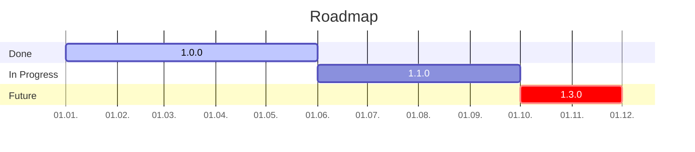
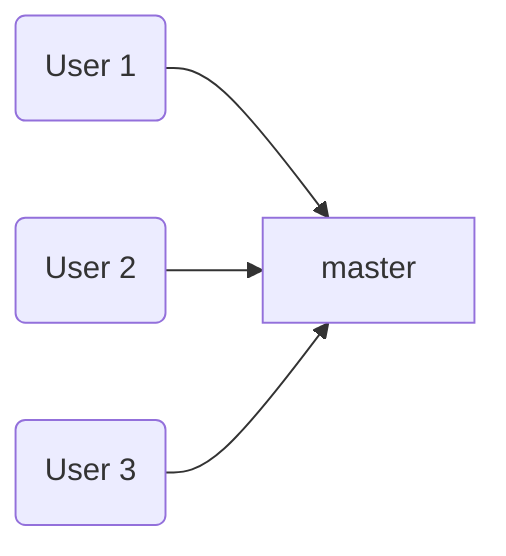
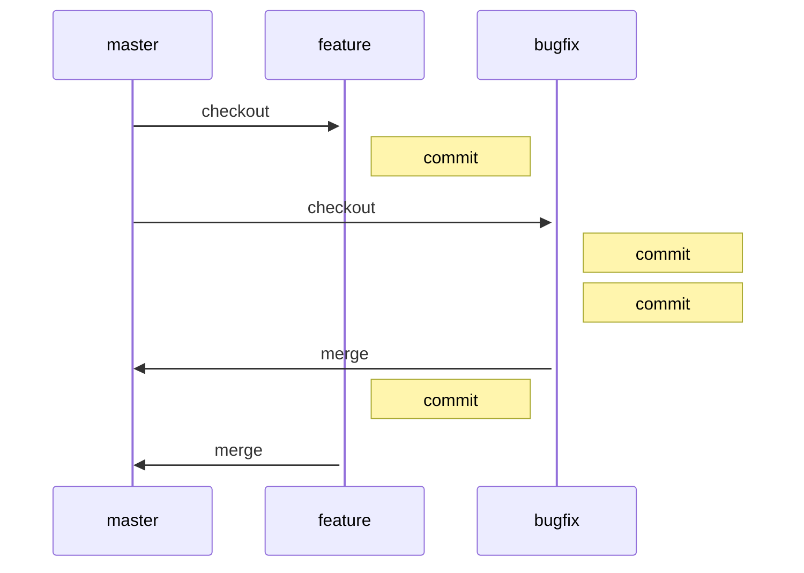
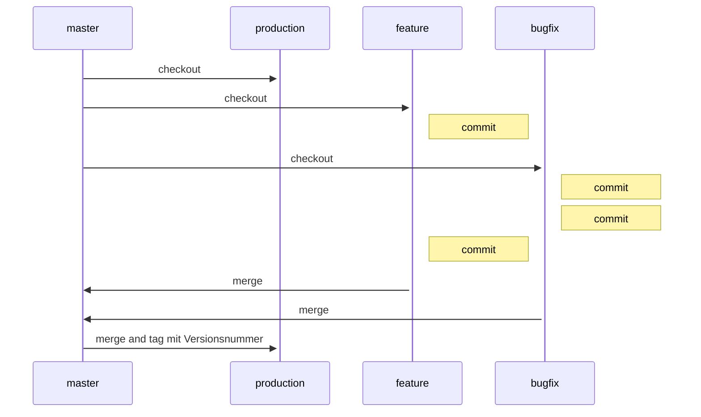
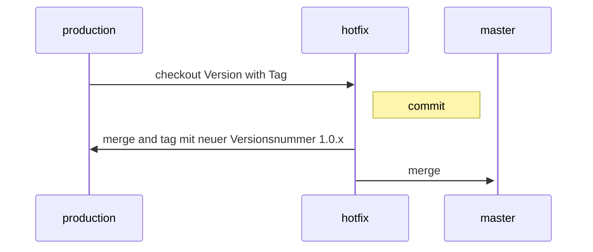

| Name                       | Status                                                       |
| -------------------------- | ------------------------------------------------------------ |
| Pipeline for `master`      | [](https://gitlab.3h-co.de/private/docker-dev-server/commits/master) |
| Pipeline for `production`  | [](https://gitlab.3h-co.de/private/docker-dev-server/commits/production) |
| Code coverage for `master` | [](https://gitlab.3h-co.de/private/docker-dev-server/commits/master) |

[[_TOC_]]

# Description

What is the project about?

## Roadmap



## Releases

All documentation about the planning and development is made under Releases. You can find pages for every release. The requirements for the releases are described there. Also design decisions and everything else which is important.

**Add a release page for every milestone you are planning to do. Complete a release cycle by starting a release issue and do all TODOs there.**

### Versioning

The version of a release is essential to identify what is in the application. I use Semantic Versions. That means I use a schema of [Major].[Minor].[Patch].[Suffix].

- **Major** is incremented when breaking changes are made
- **Minor** is incremented when new features are added
- **Patch** is incremented when only bugfixes are done
- **Suffix** is incremented on every build

The decision how the version is incremented is made by developers because only they know what is in the version. Ideally it is done before the start of the development of the release during the planning.

**Milestones** are used to sum all issues planned for the next release.

A document in the wiki for the release contains all information about the development of the release it's planning and it's requirements.

Milestones and those documents must be added manually during planning.

The release number in code and all files in the project is set by the build pipeline.

I use a magic number, 4.7.1.1, in my code as a default version. This number can be replaced during build with the correct version. The **Revision** part of the version is the ID of the pipeline. It is unique and incremented automatically which makes it to a ideal candidate for an identifier for compiled versions.

There is only one single point of truth for the version of the project. In _.gitlab.ce.yml_.

```yml
variables:
  VERSION: "1.0.0.$CI_PIPELINE_IID"
```

Change the version number here if you need to increment it and check it in in version control.

The part lists all files in which a version number needs to be updated.

```yml
version:
  stage: versioning
  script:
    - echo "The current version is set to ${VERSION}."
    - sed -i -e "s/4.7.1.1/$VERSION/g" Changelog.md
    - sed -i -e "s/4.7.1.1/$VERSION/g" Readme.md
    - sed -i -e "s/4.7.1.1/$VERSION/g" jotta-cli/Readme.md
  artifacts:
    paths:
      - Changelog.md
      - Readme.md
      - jotta-cli/Readme.md
    expire_in: 1 day
```

A snippet for this stage exists.

You need to define own stages to use the **versioning** stage.

```yml
stages:
  - versioning
  - build
```

## Git guidelines

### Centralized workflow

All development in Git should be done around a centralized workflow. This means do your changes locally first and push them to a server to share it with others. A nice side effect is that you will have backups, too.



### Feature branch

Based on the Centralized Workflow there are Feature Branches

- Each feature and bugfix is performed in its own branch.
- Commits can be pushed to the server as a backup without changes interfering with other developers.
- Only when the feature/bugfix is finished is the feature branch merged into `master`. Here conflicts are solved.
- Pros: 
  - You can check in unfinished code and experiment. If an experiment fails you can undo the changes.
  - Merging is only done at defined points in time. Unfinished code doesn't disturb other developers in their work.
  - `master` contains only stable, executable code. This doesn't say anything about the logical correctness yet.
  - Developing each feature and bugfix separately in a branch makes it easier to avoid merge conflicts and it becomes easier to resolve a conflict properly. Less code = less chance of a conflict and easier to understand the logic of the code in the conflict to make the right decision.



### Git Flow Adaption

#### Release cycle

I want to use a flow based on Git Flow, but not exactly Git Flow. I made the decision because I want to have an easier workflow because I am currently work alone on my projects and don't want to have a complex release cycle.

On the other side I like Git Flow and I think it is a well designed flow which is scalable for big teams, projects and release strategies. That is why I want to keep the opportunity to switch to the more complex Git Flow when I need it.

In Git Flow only releases are merged in `master`. Their status is always the last release. I want to use `master` as the default branch like it is intended in Git and implemented by the most tools per default. The role of the Git Flow `master` will be a branch called `production` in my flow. That is basically the only main difference to Git Flow. I also won’t use `relase` branches right now because as a single developer I don't think I will make development work in parallel for more than one release.

In Git Flow every development is based on `development`. `feature` is never merged into `master`. Because I use `master` as `development` and don't use `release` right now, `feature` is only merged into `master`.

When the development cycle is complete,  `master` is merged into `production` and a tag is created with the version number. That's it.



`feature` and `bugfix` will be merged with `squash` into `master`. I don’t need every temporary commit in my history.

`master` will be merged as `fast forward` into `production`.

### Bugfixing in old releases

Git Flow provides a `hotfix` branch for fixing a bug in an old version. I will adapt this process as done in Git Flow but will use `production` instead of `master`. When the bug is fixed a merge is done in `production` with a new updated tag with a new patch version number. The bug must also be merged into `master`.



`hostfix` will be merged `squashed` into `production` and `master`.

###Used branch types

This workflow used those types of branches:

| Name            | Function                                                     |
| --------------- | ------------------------------------------------------------ |
| `master`        | The development branch. Everything is branched from it and merged into it. |
| `production`    | Every time a release is made `master` is merged into `production` with a `tag` containing the version of the release. GitLab's milestones are used to organize the versions. |
| `feature`       | Implementation of a feature is done in an own branch branched from `master`. |
| `bugfix`        | Bugfixes are done in own branches branched from `master`.    |
| `exeperimental` | Used to mark a branch with experimental development not merged into `master` without further testing. |
| `release`       | Branch to prepare a release. Makes only sense for teams which do releases and further development in parallel. |
| `support`       | Only needed when an old version must be supported. For example because breaking changes which prevents an update to the latest version. |

### Committing with Git

#### Use SSH instead of HTTPS

You should use Two Factor Authorization. HTTPS needs a token to work. Committing via SSH is a easier way of committing.

https://docs.gitlab.com/12.2/ee/ssh/README.html describes how to generate keys and add them to GitLab.

A file _config_ has to be created.

```bash
# Private GitLab instance
Host gitlab.3h-co.de
  Preferredauthentications publickey
  IdentityFile ~/.ssh/id_ed25519
  Port 49152
```

It tells SSH how to access the GitLab instance. Note the port. Is have mapped GitLab's SSH port in _docker-compose.yml_ to the port 49152. The first free port. The configuration file tells SSH to use this port for it's connection when it connects to gitlab.3h-co.de.

Windows 10 has now a OpenSSH client. It uses this configuration so git should work like expected.

If you use tools like Tortoise Git you should install it with the non default OpenSSH client to use this system wide configuration, too.

#### Signing with GPG

To verify your commits you should sign them with GPG.

https://gitlab.3h-co.de/help/user/project/repository/gpg_signed_commits/index.md describes the hole process of generation GPG keys and configuring them in GitLab.

Some additional task has to be done on Windows to make Git work properly with GitLab.

After I created the key with PowerShell it was stored under _C:/Users/username/AppData/Roaming/gnupg_. Git is looking under _C:/Users/username/.gnupg_. So Git did not find the keys.

Creating a hard link solves the problem.

Another step is to tell Git where the GnuPG executable is.

The third step is activating automatic signing for Git.

```cmd
mklink /J C:\Users\username\.gnupg C:\Users\username\AppData\Roaming\gnupg
git config --global gpg.program "C:\Program Files (x86)\gnupg\bin\gpg.exe"
git config --global commit.gpgsign true 
```

## Building a NuGet

NuGet packages can be build with the runner when you use the image _docker-registry.3h-co.de/build-dotnet-core_.

Nexus must be registered in the container as a source for NuGet. For this task credentials are needed. You can configure those credentials via `Variables` in the UI of GitLab.

Navigate in the project to **Settings --> CI / CD --> Variables and add variables for the credentials.


You can use the credentials now in your build configuration.

```yml
build:
  stage: build
  image: docker-registry.3h-co.de/build-dotnet-core:latest
  script:
    - nuget sources add -Name "Nexus" -Source "https://nexus.3h-co.de/repository/nuget-hosted/" -username "$NEXUS_USERNAME" -password "$NEXUS_PASSWORD"
    - nuget restore MarcelMelzig.Validation.sln
    - dotnet pack -c Release
```

## Testing

xUnit is a great tool to run tests for .NET projects. There is a template already there in Visual Studio. So nothing special must be configured.

Tests are executed via Visual Studio or by command line.

The command line executes the tests in the pipeline.

The command is `dotnet test`.

Code coverage is generated by coverlet.

https://github.com/tonerdo/coverlet

The command is `dotnet test /p:CollectCoverage=true`

By using it in _gitlab-ci.yml_ the coverage information is generated. It can be used in GitLab via a regex configured under your project settings.

_Settings --> CI / CD --> General pipelines --> Test coverage parsing_

The regex for the parsing is `Total\s*\|\s\d+.\d+\%`.

## Planning of security and privacy

The GDPR makes PIAs mandatory if there is a special risk about private data. Because it is impossible to make everything save to a point where it is excluded that data could get in the hands of the wrong people PIAs should be made for every task where private data is processed.

Every PIA should be written as an own document and be stored in a directory of all PIAs. Such a directory should be a part of the Wiki because it is a work in progress and should be editable near to the project.

There is a template for writing PIAs which should be used every time.

## Estimation

Here is a guideline I use to estimate Story Points.

- **1**: _Vanishingly little effort, no risk._ I know exactly what to do and the issue is very small, like changing a label.
- **2**: _Little effort, no risk._ I know what to do, but a few steps must be done like adding documentation.
- **3**: _Little effort, no risk._ I know what to do but a few steps has to be done. Like adding a field to a form and storing it into the database plus document the process.
- **5**: _Little effort, little risk or normal effort, no risk._ Maybe the standard for development tasks. I know what to to but there is some more work involved.
- **8**: _Normal effort, little risk._ I use 8 for regular features where I don’t know how to implement it exactly.
- **13**: _Normal effort, height risk._ I use 13 for features where I don’t know nothing of the implementation.
- **21**: _Height effort, height risk._ I use 21 mainly to mark task where I haven’t any idea how to do it.
- **100:** _Unknown effort and risk._ This marks issues which must be further examined and maybe split up into more granular ones.

